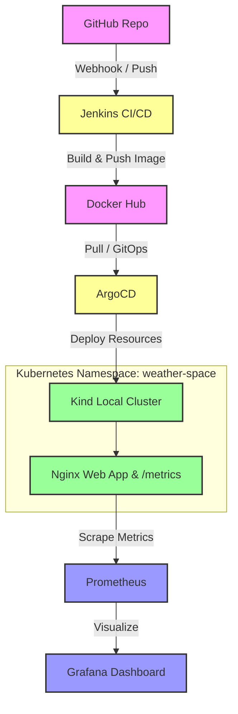

# Weather & Health DevOps Project 🌦️💪

A production-ready DevOps and GitOps pipeline implementing automated CI/CD, container orchestration, live health monitoring, and metrics scraping for a Weather & Health web application.

# Weather & Health DevOps Project 🌦️💪

A production-ready DevOps and GitOps pipeline implementing automated CI/CD, local Kubernetes orchestration via **Kind**, live health monitoring, and metrics scraping for a Weather & Health web application.

---

## 🏗️ Architecture & Minimal Workflow Diagram

    🚀 Tech Stack Used
Version Control: Git & GitHub

CI/CD Automation: Jenkins

Containerization: Docker & Docker Hub

Orchestration & GitOps: Kubernetes (kind-cluster) & ArgoCD

Web Server & Metrics: Nginx (Serves static app + exposes /metrics)

Monitoring & Observability: Prometheus & Grafana

📁 Project Structure

weather-health-devops-project/
├── argocd/
│   └── app-deployment.yaml      # ArgoCD application manifest
├── k8s/
│   ├── deployment.yaml          # Kubernetes Deployment for Weather App
│   └── service.yaml             # Kubernetes Service (ClusterIP/NodePort)
├── monitoring/
│   ├── grafana-dashboard.yaml   # Grafana dashboards configuration
│   └── prometheus.yaml          # Prometheus scraping rules and deployment
├── src/
│   ├── Dockerfile               # Dockerfile for Nginx web server & metrics
│   ├── index.html               # Main Weather & Health frontend
│   ├── script.js                # Frontend logic
│   └── style.css                # Styling sheets
├── Jenkinsfile                  # Automated CI/CD pipeline script
└── README.md                    # Project Documentation

🛠️ How to Use & Deploy
Clone the repository:

Bash
git clone [https://github.com/Huzaifakhan124/weather-health-devops-k8s.git](https://github.com/Huzaifakhan124/weather-health-devops-k8s.git)
cd weather-health-devops-project
Run Jenkins Pipeline:
Trigger the Jenkins job (weather-health-pipeline-new) to build the Docker image and push it to Docker Hub.

Deploy via ArgoCD / Kubernetes:
Apply the manifests to your Kubernetes cluster:

Bash
kubectl apply -f k8s/deployment.yaml -n weather-space
kubectl apply -f k8s/service.yaml -n weather-space

Verify Application & Monitoring:
Check your running pods and monitoring targets to ensure the web app and metrics are live:

Bash
kubectl get pods -n weather-space

